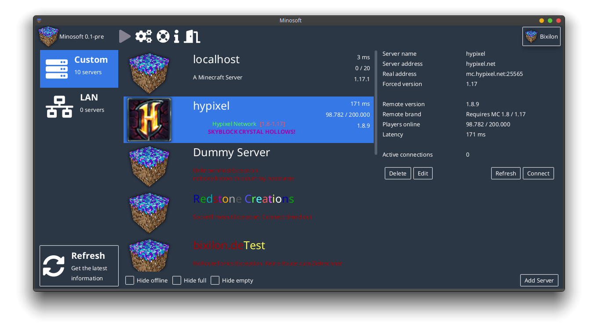

# Minosoft

Minosoft is an open source minecraft client, written from scratch in kotlin (and java). It aims to bring more functionality and stability.

<h2>Notice: I am **not** responsible for anti cheat banned accounts, this project is heavily in development!</h2>

## Feature overview

- Rendering
- Multi protocol support (1.7 - latest)
- Modding
- Bleeding edge performance (incredible start time of 3 - 5 seconds on modern hardware)
- Free (as far as we consider original minecraft as free) and open source
- Multi accounting (Offline, Mojang, Microsoft)
- Multi connections
- Multi threading and asynchronous loading
- Debugging on protocol layer
- LAN servers
- Independent, I'd accept almost all types of patches (except explicit server support)
- Way more stuff
- Multiple profiles (just choose it per server or in eros)

## System requirements

- CPU: Minosoft works mostly asynchronous, so multiple cores are good. For FPS more clock speed is better.
- RAM: Minimum 300 MiB, 1 GiB recommended
- Disk space: Minosoft itself is pretty small (2-3 MiB), the libraries are a bit bigger (~80 MiB). You also need to have the "normal" minecraft assets (~ 300 MiB per minecraft version).
- GPU: OpenGL 3.3+. Every modern GPU works and is recommended.
- Java 11+, 16+ recommended (This is really important, Minosoft uses features that are only available in this version. Java 8 is currently **not** supported).

## Rendering

### Features

- Block rendering
- Particles
- Basic light
- Block place, break, mining
- Item and block interaction
- (almost) Original physics

Works. Still missing many features, but heavily developed.

  
New hud system: full hotbar, scoreboard, bossbar, chat (+ better mipmaps)

  
The Hypixel skyblock hub

  
AFK Pooling, Hit boxes, particles, ...

  
Lighting demo.

  
Old picture with bugs

  
Picture with hotbar, biomes, biome blending, lighting, fluids, ...

  
Particles. (ignore the numbers on the campfire, I've used them to debug animations)

  
[Eros](https://en.wikipedia.org/wiki/Eros) is the main gui. You can select your account/favorite server and then connect to it. Once everything is prepared, the rendering will start.

## Version support

I always try to add support for the newest version of minecraft. Mostly it is pretty easy, just declaring it and generate all data. After pushing it, it is supported. Some versions are more complicated and need a bit of coding. I always try it as fast as possible, but sometimes I just need time.

### Supported versions

Almost all versions (and snapshots!) between 1.7 and the latest one (1.17 as of writing this). I plan to maintain Minosoft to at least version 1.20, so stay tuned. Support for older protocols will not be dropped as newer protocols are added. It is still recommended using the latest stable version.

### Unsupported versions

Minosoft uses [PixLyzer](https://gitlab.bixilon.de/bixilon/pixlyzer) as data source for all kind of data (like block ids, item ids, ...). PixLyzer currently works for 19w12a+ (1.14 snapshot) and 1.12.2 (these mappings are used for 1.7 - 1.12). 1.13 is currently unsupported and won't be in near future.

## Modding

Minosoft is modding friendly. A decent and stable API was introduced with !17. It is pretty final, but some things might still change. See [Modding.md](doc/Modding.md) for more details. The code is pretty dynamic (all blocks, items, entities, etc are stored in json files). It is pretty easy to load custom entities, etc, so adding custom blocks, etc is easily possible. Spoiler: Forge mods are NOT compatible.

## Botting

On the ToDo List

## Contribution or helping out

I'd love it. Currently, it is pretty much work for me, so please help out if you can and want :). Feel free to take a look at [Contributing.md](/Contributing.md).

## Tools and generators

I wrote some tools to help out, see [Utility](util/ReadMe.md).

## Credits

See [Credits](Credits.md).

## Releases and beta

I invested (until now!) a couple of thousand hours in this project: https://www.reddit.com/r/git/comments/np9yo7/finally_i_can_say_that_i_have_no_life/

I'll push a beta, once I think Minosoft is ready. It will still take some time, but I don't want to make a release and get a thousand issues. I know there are a ton of bugs, and I want to solve at least a couple of them. Also, a big topic is code quality. Before Minosoft, I just had a barely networking experience, no clue about the internals of minecraft, nor of kotlin or opengl. I learned so much, and you can see much code as "first draft". I'll need to do a ton of refactoring, otherwise I
can't think of PRs (they are still welcome). If you want to get current developer news, take a look in our telegram channel [@MinosoftDevNews](https://t.me/MinosoftDevNews).

## Downloads / Installation

Because there are no releases or tags yet, I don't build any versions. This will change soon™.

### Linux

The latest x64 build gets uploaded to github actions. See [github actions](https://github.com/Bixilon/Minosoft/actions)

#### Arch

Thanks to @jugendhacker you can get minosoft directly from the arch user repository (AUR): https://aur.archlinux.org/packages/minosoft-git/

### Windows

TBA

### MacOS

Works, but need a couple of workarounds. See issue [#29](https://gitlab.bixilon.de/bixilon/minosoft/-/issues/29) for details

## Building

1. Install Maven and java 11+ (On Ubuntu based distributions: `sudo apt install maven openjdk-11-jdk`). For Windows users, download and install java from oracle or openjdk. Also download maven and follow along
2. Clone this repository (`git clone https://gitlab.bixilon.de/bixilon/minosoft.git`)
3. Change directory (`cd minosoft`)
4. Optional: Checkout a current feature branch (Warning: might be unstable; might not even build) (`git checkout <branch>`)
5. Build and run Minosoft with `mvn clean verify exec:java`. If any errors occur, feel free to open an issue. In this early stage it might be helpful to delete the config file
6. (Optional) Build a fat jar with `mvn package`. You'll find the jar with all dependencies in `target/`. Then you don't need to recompile everytime

## Code mirrors
- [gitlab.bixilon.de](https://gitlab.bixilon.de/bixilon/minosoft/) (Main repository)
- [GitLab](https://gitlab.com/Bixilon/minosoft)
- [GitHub](https://github.com/Bixilon/Minosoft/)

This project/readme is work in progress, things may change over time.
